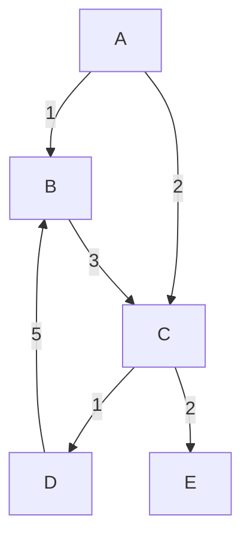

# Understanding gfold

```haskell
module Gfolds where

import Data.Graph.Inductive
import Data.Maybe (mapMaybe)
import Data.List (maximumBy)
import Data.Function (on)
```

The `gfold` function (signature below) is a very powerful, but also very confusing core part of the `fgl` Functional Graph Library.
In this document, I will try to go through its mechanics and provide some insights into how it can be used.

```
 gfold :: (Context a b -> [Node]) -> (Context a b -> c -> d) -> (Maybe d -> c -> c, c) -> [Node] -> gr a b -> c
```

There are three kinds of functions that do the work here, fold direction, depth aggregation, and breadth aggregation.
In my opinion, depth aggregation is a bit of a distracting misnomer. The difference between the two is that "depth"
aggregation is context-centric (you can think of it as being node-centric too) and computes some function at the node level.
The breadth aggregation combines many such function outputs.

The general flow is, use the context and a running value to produce a context summary,
then combine many context summaries into a running value. There is a back and forth there
that makes conceiving of differing types (the `c` and `d`) a bit difficult.

Below we will go through each of these function types, using our example graph:

```
         A
        / \
       1   2
      /     \
     v       v
     B---3-->C
     ^      / \
      5    1   2
       \  /     \
         v       v
         D       E
```

Or if your markdown viewer can do mermaid:


In `fgl`, this graph is defined:

```haskell
g :: Gr Char Int
g = mkGraph [(0,'A'),(1,'B'),(2,'C'),(3,'D'),(4,'E')] [(0,1,1),(0,2,2),(1,2,3),(2,3,1),(2,4,2),(3,1,5)]
```

## Fold Direction

This is the easy one:

```haskell
type FoldDir a b = Context a b -> [Node]
```

Given a context, provide a list of nodes to visit next. In a directed graph,
this makes it easy to fold "forward" or "backward" using `suc'` and `pre'`,
respectively, but any policy for choosing which edges to follow can be dropped
in here.

For instance, we may only want to greedily follow maximum weight edges:

```haskell
followMax :: Ord b => Context a b -> [Node]
followMax ctx =
    let sucs = lsuc' ctx
    in  if null sucs
        then []
        else [fst $ maximumBy (compare `on` snd) sucs]
```
## Breadth Aggregation

```haskell
type BreadthAgg c d = Maybe d -> c -> c
```

This function is a bit easier to understand, so we'll look at it before depth
aggregation. It is used (internally to `gfold`) to fold the results of depth
aggregations into the result value. Unfortunately, the specification leaks some
of the implementaiton of `gfold` by requiring `Maybe d`. In practice, this will
always be a `Just` value. The `Maybe` comes from the fact that the nodes
produced by the fold direction function may not exist in the graph. For well
formed folds you should not experience a `Nothing`.

As a quick example of this, cosider this fold:

```haskell
countNothing :: Node -> Gr Char Int -> Int
countNothing n = gfold suc' (\_ c -> c) (\md c -> maybe (c+1) (const c) md,0) [n]
```

If we start at an existing node, we do not see any `Nothing`s.

```
> countNothing 0 g
0
```

If we start at an invalid node, we do.


```
> countNothing 9 g
1
```

Likewise, if we did not use `suc'`, but a function that could produce invalid nodes (or nodes that no longer
existed in a decomposed graph) then we might also see `Nothing`.

To handle the `Maybe`, we'll introduce the `maybeAgg` function, which constructs
a breadth aggregation function out of a a simpler `d -> c -> c` function.

```haskell
-- Utility to deal with the Maybe in the gfold breadth aggregation function.
maybeAgg :: (d -> c -> c) -> Maybe d -> c -> c
maybeAgg f md c = maybe c (flip f c)  md
```

Now something like `maybeAgg (+)` will construct a summing aggregation. In fact,
when `c ~ d`, many monoidal operations will be useful, e.g. `maybeAgg (:)`,
`maybeAgg max`, or `maybeAgg (<>)`.

## Depth aggregation

```haskell
type DepthAgg a b c d = Context a b -> c -> d
```

The next function takes a context, and combines it with the accumulated value
(`c`), returning a possibly different type (`d`).

In many cases, one can think of the depth function as a context function
composed with an aggregation function, e.g.

```haskell
mkDepthAgg :: (Context a b -> d') -> (d' -> c -> d) -> (Context a b -> c -> d)
mkDepthAgg f g = g . f
```

This is the first place where things can get confusing, because it may not be
immediately obvious why or how one would return this new type (`d`), especially when
it will later be combined with a `c` again.

First, they don't *have* to be different. In many cases they will be the same.
For example, counting or summing folds will typically have `c` and `d` as
ether `Int` or `Float`.

An example depth aggregation with `c ~ d` would be:

```haskell
countAgg :: Context a b -> Int -> Int
countAgg _ c = c+1

countNodes :: Gr a b -> Int
countNodes = gfold suc' countAgg (maybeAgg (+),0) [0]
```

```
> countNodes g
5
```

As discussed, however, depth aggregation and breadth aggregation do not
have the same type in general. The examples that follow demonstrate
different ways that this can happpen. The tricky bit is that `c` and `d`
need to be combined *somehow* in both aggregation functions.

### Delayed Computation

One application is to delay some kind of computation until the next aggregation step.
For instance, suppose that I want to compute an edge quantity that decays
by degree (which is a strange function indeed). I might create functions such as


```haskell
countSucAgg :: Context a Int -> c -> (Int, Int, c)
countSucAgg ctx c =
    let outDegree = outdeg' ctx
        sucWeights = map snd $ lsuc' ctx
    in (outDegree, sum sucWeights, c)

aggNorm (d,n,c) c' =
    if d > 0
    then (c+c'+fromIntegral n)/fromIntegral d
    else 0.0

normedPath :: Gr Char Int -> Float
normedPath = gfold suc' countSucAgg (maybeAgg aggNorm,0.0) [0]
```

```
> normedPath g
3.75
```

### Recursive Data Structures

A natural place where differing (but related) types show up is in recursive data structures.
Consider a `Tree` definition,

```haskell
data Tree a = Node a [Tree a] deriving Show
```

We can convert a graph into a spanning tree using

```haskell
spanningTree :: Gr Char Int -> Maybe (Tree Char)
spanningTree = maybeHead . gfold suc' (Node . lab') (maybeAgg (:),[]) [0]
  where
    maybeHead [] = Nothing
    maybeHead xs = Just (head xs)
```

```
> spanningTree g
Just (Node 'A' [Node 'B' [Node 'C' [Node 'D' [],Node 'E' []]]])
```

In this mode, depth and breadth take turns wrapping and collecting levels of the
recursion. We can make this back and forth explicit by making a very general
(and useless) types,

```haskell
data Depth a = D a (Breadth a) deriving Show
data Breadth a = B (Depth a) (Breadth a) | Init deriving Show

foldStructure :: Gr a b -> Breadth a
foldStructure = gfold suc' (D . lab') (maybeAgg B,Init) [0]
```

```
> foldStructure g
B (D 'A' (B (D 'B' (B (D 'C' (B (D 'D' Init) (B (D 'E' Init) Init))) Init)) Init)) Init
```

## Deconstructions

Like many funcitons in `fgl`, `gfold` works by calling `match` recursively,
which *decomposes* the graph as it goes. Graph decomposition means that a
visited node is *removed* from the graph.  This can create odd results if you
are expecting the graph to be static as the fold progresses.

Consider this fold:


```haskell
collectLabels :: Gr Char Int -> String
collectLabels = gfold suc' (\ctx c -> (lab' ctx):c) (maybeAgg (++),"") [0]
```
```
> collectLabels g
"ABCDE"
```

That seems likely enough; it shows the order in which the nodes have been
visited. If we examine the graph at each node, however, we see this:

```haskell
collectPreds :: Gr Char Int -> [(Char,String)]
collectPreds g = gfold suc' (\ctx c -> (lab' ctx, mapMaybe (lab g) (pre' ctx)):c) (maybeAgg (++),[]) [0] g
```

```
> collectPreds g
[('A',""),('B',"D"),('C',""),('D',""),('E',"")]
```

Almost no predecessors! Usually this is not a problem, here we are looking
"backward" even though we are folding "forward". Still, it is good to be aware
that you do not have access to the full structure of the *original* graph as
the fold progresses.

A more subtle version is:

```haskell
collectSucs :: Gr Char Int -> [(Char,String)]
collectSucs g = gfold suc' (\ctx c -> (lab' ctx, mapMaybe (lab g) (suc' ctx)):c) (maybeAgg (++),[]) [0] g
```

```
> collectSucs g
[('A',"BC"),('B',"C"),('C',"DE"),('D',""),('E',"")]
```

Here we see mostly what we expect, except that `'D'` has no successors. This is
because by the time `D` is visited, `B` has been removed from the graph.
Deconstruction provides an elegant solution to operations like folding over
graphs that might contain loops or need anything like a spanning tree. This is
common, so deconstruction is very useful, but again, it's something to remember
is happening behind the scenes.

One final example will demonstrate how you might think you are computing
something that you actually are not. Let's say we would like to sum all of the
weights in our graph. A fold seems like it might be a good way to do that, so
we write:

```haskell
sumEdges :: Gr Char Int -> Int
sumEdges = gfold suc' (\ctx c -> c + sum (map snd (lsuc' ctx))) (maybeAgg (+), 0) [0]
```

```
> sumEdges g
9
```

Hmm, we expect `1+2+3+1+2+5 = 14`! The difference is of course what we saw in
`collectSucs`. The edge from `D` to `B` gets deleted before we visit `D`, along
with its label. As such, `gfold` is not always the right answer. If you need to
access every edge, there are other tools, e.g.:

```haskell
actuallySumEdges :: Gr Char Int -> Int
actuallySumEdges g = sum $ map edgeLabel (labEdges g)
```

```
> actuallySumEdges g
14
```


