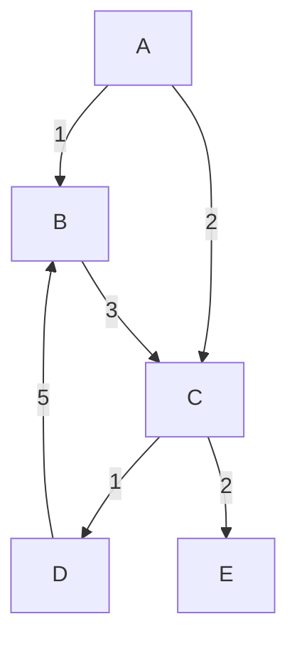

# Understanding gfold

```haskell
module Gfolds where

import Data.Graph.Inductive
import Data.Maybe (mapMaybe)
import Data.List (maximumBy)
import Data.Function (on)
```

The `gfold` function (signature below) is a very powerful, but also very confusing core part of the `fgl` Functional Graph Library.
In this document, I will try to go through its mechanics and provide some insights into how it can be used.

```
 gfold :: (Context a b -> [Node]) -> (Context a b -> c -> d) -> (Maybe d -> c -> c, c) -> [Node] -> gr a b -> c
```

There are three kinds of functions that do the work here, fold direction, depth aggregation, and breadth aggregation. Below we will go through each one, often
using our example graph:

```
         A
        / \
       1   2
      /     \
     v       v
     B---3-->C
     ^      / \
      5    1   2
       \  /     \
         v       v
         D       E
```

Or if your markdown viewer can do mermaid:


In `fgl`, this graph is defined:

```haskell
g :: Gr Char Int
g = mkGraph [(0,'A'),(1,'B'),(2,'C'),(3,'D'),(4,'E')] [(0,1,1),(0,2,2),(1,2,3),(2,3,1),(2,4,2),(3,1,5)]
```

## Fold Direction

This is the easy one:

```haskell
type FoldDir a b = Context a b -> [Node]
```

Given a context, provide a list of nodes to visit next. In a directed graph,
this makes it easy to fold "forward" or "backward" using `suc'` and `pre'`,
respectively, but any policy for choosing which edges to follow can be dropped
in here.

For instance, we may only want to greedily follow maximum weight edges:

```haskell
followMax :: Ord b => Context a b -> [Node]
followMax ctx =
    let sucs = lsuc' ctx
    in  if null sucs
        then []
        else [fst $ maximumBy (compare `on` snd) sucs]
```

## Depth aggregation

The next function takes a context, and combines it with the accumulated value
(`c`), returning a possibly different type (`d`). This is the first place where
things can get confusing, because it may not be immediately obvious why or how
one would return this new type, especially when it will later be combined with
a `c` again.

First, they don't *have* to be different. In many cases they will be the same.

## Deconstructions

Like many funcitons in `fgl`, `gfold` works by calling `match` recursively,
which *decomposes* the graph as it goes. Graph decomposition means that a
visited node is *removed* from the graph.  This can create odd results if you
are expecting the graph to be static as the fold progresses.

Consider this fold:

```haskell
-- Utility to deal with the Maybe in the gfold breadth aggregation function.
maybeAgg :: (d -> c -> c) -> Maybe d -> c -> c
maybeAgg f md c = maybe c (flip f c)  md

collectLabels :: Gr Char Int -> String
collectLabels = gfold suc' (\ctx c -> (lab' ctx):c) (maybeAgg (++),"") [0]
```
```
> collectLabels g
"ABCDE"
```

That seems likely enough; it shows the order in which the nodes have been
visited. If we examine the graph at each node, however, we see this:

```haskell
collectPreds :: Gr Char Int -> [(Char,String)]
collectPreds g = gfold suc' (\ctx c -> (lab' ctx, mapMaybe (lab g) (pre' ctx)):c) (maybeAgg (++),[]) [0] g
```

```
> collectPreds g
[('A',""),('B',"D"),('C',""),('D',""),('E',"")]
```

Almost no predecessors! Usually this is not a problem, here we are looking
"backward" even though we are folding "forward". Still, it is good to be aware
that you do not have access to the full structure of the *original* graph as
the fold progresses.

A more subtle version is:

```haskell
collectSucs :: Gr Char Int -> [(Char,String)]
collectSucs g = gfold suc' (\ctx c -> (lab' ctx, mapMaybe (lab g) (suc' ctx)):c) (maybeAgg (++),[]) [0] g
```

```
> collectSucs g
[('A',"BC"),('B',"C"),('C',"DE"),('D',""),('E',"")]
```

Here we see mostly what we expect, except that `'D'` has no successors. This is
because by the time `D` is visited, `B` has been removed from the graph.
Deconstruction provides an elegant solution to operations like folding over
graphs that might contain loops or need anything like a spanning tree. This is
common, so deconstruction is very useful, but again, it's something to remember
is happening behind the scenes.

One final example will demonstrate how you might think you are computing
something that you actually are not. Let's say we would like to sum all of the
weights in our graph. A fold seems like it might be a good way to do that, so
we write:

```haskell
sumEdges :: Gr Char Int -> Int
sumEdges = gfold suc' (\ctx c -> c + sum (map snd (lsuc' ctx))) (maybeAgg (+), 0) [0]
```

```
> sumEdges g
9
```

Hmm, we expect `1+2+3+1+2+5 = 14`! The difference is of course what we saw in
`collectSucs`. The edge from `D` to `B` gets deleted before we visit `D`, along
with its label. As such, `gfold` is not always the right answer. If you need to
access every edge, there are other tools, e.g.:

```haskell
actuallySumEdges :: Gr Char Int -> Int
actuallySumEdges g = sum $ map edgeLabel (labEdges g)
```

```
> actuallySumEdges g
14
```


